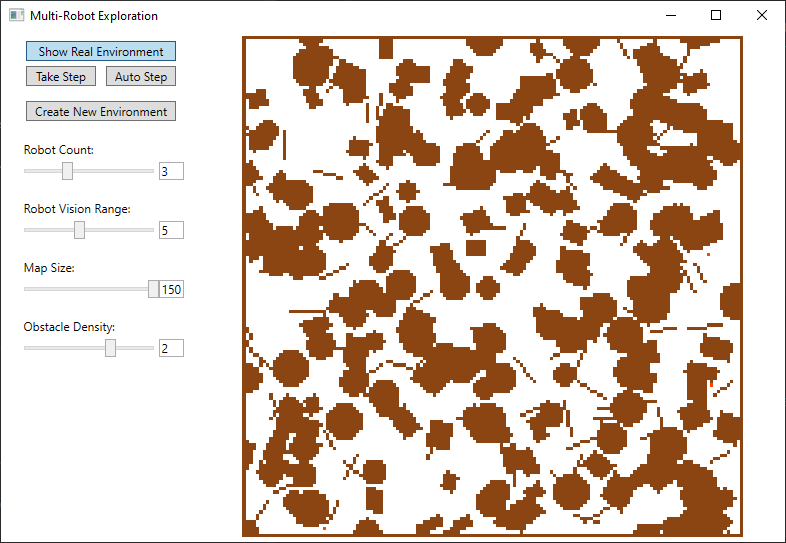

# MultiRobotExploration

Based on the paper Burgard, W., Moors, M., Stachniss, C., & Schneider, F. E. (2005). Coordinated multi-robot exploration. IEEE Transactions on Robotics, 21(3), 376-386.

Simulated robots automatically explore unknown spaces on the map:

Generates random maps based on settings:

